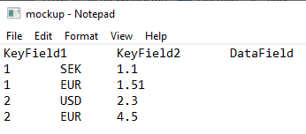
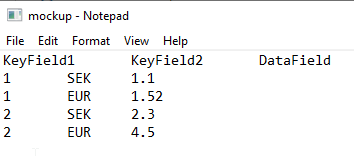
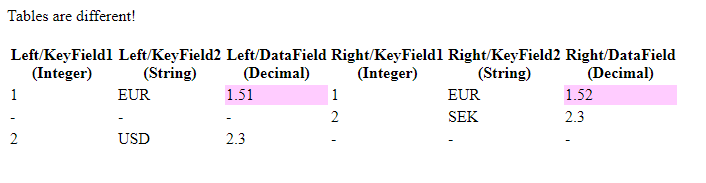

# GlitchFinder
Finding glitches in the matrix

## Basic usage
 Either compare two different datasets or compare a single dataset towards itself over time.

 If there are glitches in the matrix then you get a report showing lines that are missing or different in the two datasets.

### Comparison
 This is for comparing two different data sources, could be two different files, two different DB queries, one file vs one query etc.

### Regression test
 This is for tracking a single dataset/source over time. You create a baseline, which is stored on file, and then later compare data towards this baseline.

### Example

You have a dataset and create a baseline.  
 

Then the dataset changes and you do a regression test.  
 

And get the differences:  
 

 
## Commands
    glfc
Lists usages.  

    glfc <config file>
Run comparison specified in config file

    glfc -NewComparison <config file>
Create config file suitable for comparison

    glfc -Baseline <config file>
    
Create a baseline before regression test

    glfc -RegressionTest <config file>     
Run regression test against baseline

    glfc -NewRegressionTest <config file>
Create config file suitable for regression test 

